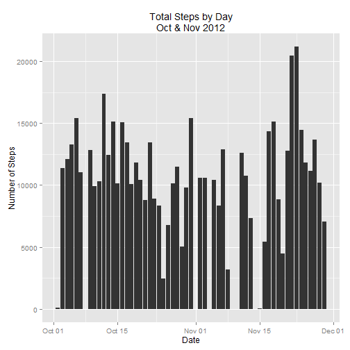
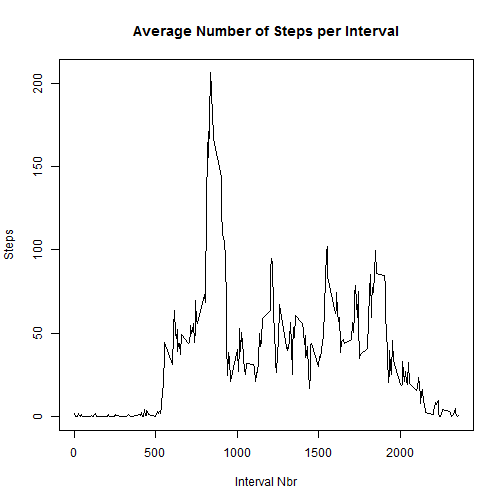
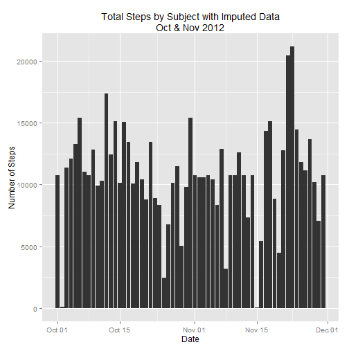
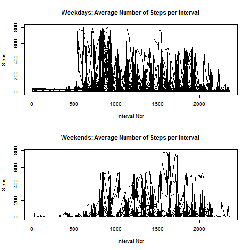

This project analyzes data collected from a single individual at 5 minute intervals through out the day, during the months of October and November, 2012.  

The overall structure followed will be: 

1. Load the raw data. 
2. Create a modified data set to handle missing values.   
3. The following data analysis steps on the raw data: 
  + Histogram of the total number of steps per day 
  + Median and mean per day 
4. Interval-based analysis 
  + Summary plot of total average steps per 5 minute interval 
  + State the interval with the highest number of steps 
5. Imputing missing values 
  + Explain and execute the approach 
  + Plot average steps per 5 minute interval, with imputed data 
  + Compare imputed to raw data
6. Analyze differences between weekdays and weekends
  + Segregate the data
  + Plot both weekday and weekend data 
  
  
  

## Loading and preprocessing the data

```r
library(dplyr)
library(ggplot2)
library(lubridate)
```


```r
setwd("C://NotDropboxed//Learning//Reproducible Research//Assignments and Quizzes//Assignment 1//RepData_PeerAssessment1")
raw<-read.csv("activity.csv")
raw$date <-ymd(as.character(raw$date))
summary(raw) # For simple overview of loaded data.  
```

```
##      steps             date               interval     
##  Min.   :  0.00   Min.   :2012-10-01   Min.   :   0.0  
##  1st Qu.:  0.00   1st Qu.:2012-10-16   1st Qu.: 588.8  
##  Median :  0.00   Median :2012-10-31   Median :1177.5  
##  Mean   : 37.38   Mean   :2012-10-31   Mean   :1177.5  
##  3rd Qu.: 12.00   3rd Qu.:2012-11-15   3rd Qu.:1766.2  
##  Max.   :806.00   Max.   :2012-11-30   Max.   :2355.0  
##  NA's   :2304
```

```r
unloadNamespace("lubridate") # causes conflicts, so we unload it temporarily 
```
 
## What is mean total number of steps taken per day?

```r
grouped<-group_by(raw,date)
dailyTotals <- summarise(grouped,sumSteps=sum(steps),meanSteps=mean(steps,na.rm=T),medianSteps=median(steps,na.rm=T))
```
The daily mean steps is 10,766 and the daily median steps is 10,765.

## Overview plot of the data

```r
p<-ggplot(dailyTotals,aes(x=date, y=sumSteps)) +             geom_histogram(stat="identity")+ 
labs(title="Total Steps by Day\nOct & Nov 2012",
     x="Date", y="Number of Steps")
p
```

 


## What is the average daily activity pattern?
Taking the average number of steps, per interval, across all days in the sample.  

```r
groupedByInterval<-group_by(raw,interval)
totalsByInterval <- summarise(groupedByInterval,steps=mean(steps,na.rm=T))
plot(x=totalsByInterval$interval,y=totalsByInterval$steps,xlab="Interval Nbr",ylab="Steps",main="Average Number of Steps per Interval",type="l")
```

 


The interval with the highest average number of steps, across all days, is interval 835.   

## Imputing missing values
Of the 17568 samples, 2304 are missing("NA").  To complete the data, we will assign all of the missing values to the average for all days for that specific interval.  This will be referred to as "imputed data".  The code appears below: 


```r
imputed<-raw # copy the raw data, including the NAs
for(i in 1:nrow(imputed)) {
  if (is.na(imputed[i,1]))  {
    # Calculate where in the row number in the averages table which contains the
    # relevant average for the interval
    rownum <- (trunc(imputed[i,3]/100)*12+(imputed[i,3]%%100)/5)+1
    imputed[i,1]<- totalsByInterval[rownum,2]
  }
}  
```

Re-running the analysis of the daily totals (as above, but now with the imputed results for the missing data.)


```r
groupedImputed<-group_by(imputed,date)
dailyTotalsImputed <-summarise(groupedImputed,sumSteps=sum(steps),
                    meanSteps=mean(steps,na.rm=T),
                    medianSteps=median(steps,na.rm=T))

p<-ggplot(dailyTotalsImputed,aes(x=date, y=sumSteps)) +             geom_histogram(stat="identity")+ 
labs(title="Total Steps by Subject with Imputed Data\nOct & Nov 2012",
     x="Date", y="Number of Steps")
p
```

 

The daily mean steps using **imputed data** is 10,766 and the daily median steps is 10,766.   These values are nearly identical to the raw data (without imputing the missing data).  


## Are there differences in activity patterns between weekdays and weekends?


```r
raw$weekend<- (weekdays(ymd(as.character(raw$date))) %in% c("Saturday","Sunday"))
weekdaysData <- raw[!raw$weekend,]
weekendsData <- raw[raw$weekend,]
layout(matrix(c(1,1,2,2), 2,2, byrow = TRUE))

# Weekdays first 
weekdaysByInterval<-group_by(weekdaysData,interval)
weekdaystotalsByInterval <- summarise(weekdaysByInterval,steps=mean(steps,na.rm=T))
plot(x=weekdaysByInterval$interval,y=weekdaysByInterval$steps,xlab="Interval Nbr",ylab="Steps",main="Weekdays: Average Number of Steps per Interval",type="l")

# Weekends  
weekendsByInterval<-group_by(weekendsData,interval)
weekendstotalsByInterval <- summarise(weekendsByInterval,steps=mean(steps,na.rm=T))
plot(x=weekendsByInterval$interval,y=weekendsByInterval$steps,xlab="Interval Nbr",ylab="Steps",main="Weekends: Average Number of Steps per Interval",type="l")
```

 

The conclusion of the above is that the subject walks less on weekends, and his/her day starts later.  
